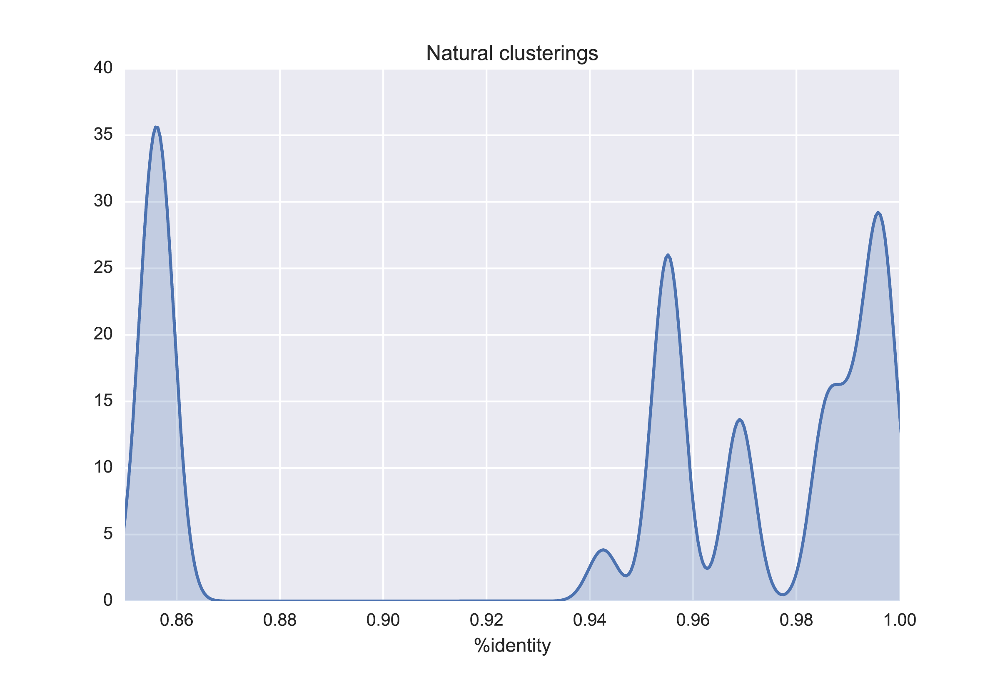

```{r setup, include=FALSE}
knitr::opts_chunk$set(echo = FALSE)

library(dplyr)
library(ggnetwork)
library(ggplot2)
library(googleVis)
op = options(gvis.plot.tag='chart')
library(igraph)
library(intergraph)
library(knitr)
library(stringr)
library(tidyr)

# SCALING DATA
#============================
# A dataframe to illustrate how the number of required alignments
# scales with input sequences for ANI
scaledf = data.frame(seq.count=c(2, 5, 10, 50, 100, 500, 1000, 5000, 10000))
scaledf$all.vs.all = scaledf$seq.count^2 - scaledf$seq.count
scaledf$anim = scaledf$all.vs.all/2

# Show effect of increasing number of cores, in days to run
cores = scaledf[, c("seq.count", "anim")]
cores$cores.001 = cores$anim
cores$cores.004 = cores$anim/4
cores$cores.016 = cores$anim/16
cores$cores.128 = cores$anim/128
cores = cores %>% select(-anim) %>% gather(cores, days, -seq.count)
cores$days = cores$days/(60*60*24)

# SRE Taxonomy Sankey Plots
#===========================

# Reclassified isolates
genus = read.table("data/dickeya/genus_sankey.csv", sep=",", header=TRUE)
species = read.table("data/dickeya/species_sankey.csv", sep=",", header=TRUE)
gcs = read.table("data/dickeya/genus_class_species.csv", sep=",", header=TRUE)

# Relationships between historical taxonomic classifications
sretaxdata = data.frame(origin=c(rep('E. carotovora', 3),
                                 'E. chrysanthemi',
                                 rep('P. carotovorum', 2),
                                 'P. atrosepticum',
                                 'P. wasabiae',
                                 rep('P. chrysanthemi', 6)),
                        renamed=c('P. carotovorum',
                                  'P. atrosepticum',
                                  'P. wasabiae',
                                  'P. chrysanthemi',
                                  'P. c. subsp. carotovorum (Pcc)',
                                  'P. c. subsp. brasiliense (Pcb)',
                                  'P. atrosepticum (Pba)',
                                  'P. wasabiae (Pwa)',
                                  'D. dianthicola',
                                  'D. dadantii',
                                  'D. zeae',
                                  'D. chrysanthemi',
                                  'D. dieffenbachiae',
                                  'D. paradisiaca'),
                        weights=c(6, 6, 6, 6,
                                  rep(3, 2),
                                  rep(6, 2),
                                  rep(1, 6)))
```

<!--
SECTION 1: Context
--!>

# 1. Context

## Background

<!-- This is needed to get the Hutton background throughout --!>


- RD2.1.4: "[a] resource for rapid molecular fingerprinting of Dickeya and Pectobacterium"

<div class="highlight">
- `pyani` evolved from diagnostics work on *Pectobacterium*/*Dickeya*
- computational tool for rapid calculation and analysis of average nucleotide identity (ANI)
    - First release August 2015; Current release: v0.2.5 (Sep 2017)
</div>

- Public webpage: [http://widdowquinn.github.io/pyani/](http://widdowquinn.github.io/pyani/)
- Available as `Docker` container:
    - `docker run -v ${PWD}:/host_dir leightonpritchard/average_nucleotide_identity`
   
   
## Average Nucleotide Identity (ANIm)

<div class="highlight">
**Whole-genome sequence replacement for DDH**
</div>

<div class="col2">
- align genomes
- calculate mean %identity of all homologous regions
- **"70% identity" (DDH) ≈ 95% identity (ANIm)**

<p>

</p>
</div>

<div class="attention">
- insensitive to dataset composition (unlike clustering)
- **approximate limiting case of MLST/MLSA/multigene comparisons**
</div>

<div class="references">
- [Goris *et al.* (2007) *Int. J. Syst. Microbiol.* doi:10.1099/ijs.0.64483-0](https://dx.doi.org/10.1099/ijs.0.64483-0) - ANI method
- [Richter and Rossello-Mora (2009) Proc. Natl. Acad. Sci. USA doi:10.1073/pnas.0906412106](https://dx.doi.org/10.1073/pnas.0906412106) - ANIm method, JSpecies tool
</div>

## `pyani`

<div class="highlight">
**`python` package and scripts for ANI**
</div>

<div class="col2">
- available on `PyPI` and `Docker`
- ANIm, ANIb etc.
- calculates, visualises results
- parallelises under SGE/OGE
<center>

</center>

<p>

</p>
</div>

<div class="references">
- [Pritchard *et al.* (2015) *Anal. Methods* doi:10.1039/C5AY02550H](https://dx.doi.org/10.1039/C5AY02550H) - `pyani` used on SRE
</div>


## `pyani` in the wild

<div class="highlight">
**Downloads**

- Since 2015: 22117
- 2017: 12808
- October 2017: 2164
</div>

- Used at `LINBase`: [Life Identification Numbers](http://128.173.74.68/CodeIgniter/index.php/login), Virginia Tech.

<div class="attention">
**Citations**

Hard to track - editors/authors don't often cite DOIs - at least 12 papers used it, including:

- Burstein *et al.* (2016) "New CRISPR–Cas systems from uncultivated microbes" *Nature* [doi:10.1038/nature21059](https://dx.doi.org/10.1038/nature21059)
</div>


# 2. What it does well

## Scaling

- ANI is based on pairwise genome alignments
- Sequence alignment is computationally expensive
- The number of alignments scales with the square of sequences to be aligned: $O(n^2)$

<div class="col2">
```{r}
scaledf
```

<p><center>
```{r fig.width=4, fig.height=4}
p1 = ggplot(scaledf, aes(x=seq.count, y=anim))
p1 + geom_point() + scale_y_log10() + scale_x_log10()
```
</center></p>
</div>


## Parallelisation

<div class="highlight">
We can't avoid the alignment, *but* we can use all available processors
</div>

- desktop/laptop: `multiprocessing` - one alignment per core
- cluster: `SGE/OGE` - one alignment per core (not in `JSpecies`)

<center>
```{r, fig.height=4}
p1 = ggplot(cores, aes(x=seq.count, y=days, color=cores))
p1 + geom_point() + stat_smooth(aes(x=seq.count, y=days), method="loess")
```
</center>


## Visualisation

<div class="highlight">
`pyani` produces tables of output, but also heatmaps/dendrograms
</div>

- clear visualisation of "species" boundaries

<div class="col2">


<p>

</p>
</div>


## Coverage measures

<div class="attention">
ANI (and `JSpecies`) reports only identity of aligned regions.

We want to know how much of each genome aligns.
</div>

<div class="col2">


<p>

</p>
</div>


## Meaningful interpretation

<div class="highlight">
Visualising coverage and identity together is more powerful:

"species" and "genus" identification
</div>

<div class="col2">


<p>

</p>
</div>


# 3. How to improve

## Installation and use

<div class="attention">
`pyani` has multiple dependencies

- `Python` and several packages
- `MUMmer`/`BLAST+`

Not all run on Windows, and program versions matter.
</div>

<div class="highlight">
The `Docker` container system:

- allows all dependencies to be packaged together
- can be run on Windows/OSX/Linux
</div>

- install Docker: [https://www.docker.com/docker-windows](https://www.docker.com/docker-windows)
- run `pyani`: `docker run -v ${PWD}:/host_dir leightonpritchard/average_nucleotide_identity`


## User Interface (UI)

Currently two scripts:

- `average_nucleotide_identity`
- `genbank_get_genomes_by_taxon`

<div class="attention">
*Many* options to be specified makes for long command-lines
</div>

```
$ average_nucleotide_identity.py -o OUTDIR -i INDIR \
  -m ANIm -v -f -l LOGFILE \
  -g --gformat pdf,png,svg --gmethod seaborn \
  --labels LABELS --classes CLASSES \
  --scheduler SGE --jobprefix ANIm_Rickettsia
```

<div class="attention">
- easy to make mistakes
- all possible actions run in a single command, but decomposition is possible
</div>

## User Interface (UI)

<div class="highlight">
Break analysis into steps, *via* subcommands
</div>

```
pyani.py download SEQDIR -v \
     --email my.email@my.domain -t 203804 \
     -l LOGFILE
pyani.py createdb -v -l LOGFILE
pyani.py anim SEQDIR ANIDIR -v -l LOGFILE --name NAME \
     --labels LABELS --classes CLASSES
pyani.py report -v --runs OUTDIR --formats html,excel,stdout \
     --run_results 1,3
pyani.py plot OUTDIR 1,3 -v --formats png,pdf
```

1. Download genomes
2. Create database
3. Run analysis (results $\rightarrow$ database)
4. Report results
5. Visualise results


## Database backend

<div class="attention">
Adding/removing even a single genome to the analysis would require the complete analysis to be re-run
</div>

<div class="highlight">
Storing previous results in a database means we never have to rerun a pairwise comparison
</div>

<center>
```{r, fig.height=4}
p1 = ggplot(cores, aes(x=seq.count, y=days, color=cores))
p1 + geom_point() + stat_smooth(aes(x=seq.count, y=days), method="loess")
```
</center>


## Database backend

<div class="highlight">
[`SQLite3`](https://www.sqlite.org/): lightweight RDBMS
</div>

- persistent storage: run once, report/visualise many times
- makes additive, incremental extension analyses possible
- can be located/shared anywhere (created in current directory by default)
    - can have a 'global' database, and an independent 'local' database
- can be merged with other databases (combining precalculated results)

<div class="highlight">
Forces analyses to be transparent and reproducible
</div>

## Identifying unique analyses

<div class="attention">
How can we determine whether a pairwise comparison has been run before?
</div>

**Metadata**

- same sequence
- same analysis type (ANIm/ANIb/ANIblastall/TETRA)
- same program (BLASTN/MUMmer) and version
- same program options (`--maxmatch`, substitution matrix)

<div class="highlight">
Forces analyses to be transparent and reproducible
</div>


## Identifying the same sequences

<div class="attention">
Not by global pairwise alignment - that's what we're trying to avoid!
</div>

<div class="highlight">
**Hash functions**

- one-way 'trapdoor' functions: $f(\textrm{input}) \rightarrow \textrm{much smaller output}$
- output is fixed size
- distinct inputs should give distinct outputs (no *collisions*)
- small changes in input $\rightarrow$ large changes in output
</div>

- Each unique genome is represented by its (ND5) *hash*

**Common hashes**

- MD5, SHA-256, CRC, etc.
- often used to uniquely identify large documents/files

<div class="references">
- [https://en.wikipedia.org/wiki/Hash_function](https://en.wikipedia.org/wiki/Hash_function) - hash functions at Wikipedia
</div>

## Identifying the same sequences

<div class="highlight">
`pyani` avoids repeating analyses
</div>

- user provides a directory of genomes
- `pyani` calculates/checks the hashes of all the genomes against the database: has it seen them?
- `pyani` identifies which comparisons need to be made
    - notes program versions and arguments
    - checks if combination of genomes/program/arguments already run
    - if comparison already run, it is not rerun, and the result is used again
    
<div class="highlight">
The analysis is rerun and stored in the database again if:

- the sequence has changed
- the program (e.g. `MUMmer`) version has changed
- the selection of alignment parameters has changed
</div>


## Automated classification

**ANI Results Define Graphs**

<div class="highlight">
**ANIm of all sequenced SRE genomes.** Edges > 50% coverage
</div>

- three main groups (genera)

<center>


</center>

## Automated classification

<div class="highlight">
*cliques* - *k*-complete graphs - are 'natural' clusterings
</div>

- clique membership varies with ANI %identity
- clique membership (at given %ID) is permanent and scales

<div class="attention">
at some %identity values, all graph components are cliques, and all genomes belong to a single clique (no *confusion*)
</div>

<center>


</center>


## Network Deconstruction

```{r network_deconstruct}
sre_graph = read_graph('data/dickeya/sre_anim_graph.gml', format='gml')

shinyApp(
  ui = fluidPage(
    fluidRow(
      column(3,
        sliderInput("identity", label = "Identity threshold:",
                    min = 0.85, max = 0.999, value = 0.85, step = 0.001)
      ),
      column(2,
        radioButtons("legend", "legend",
                     choices=c("clique", "genus", "species"))
      ),
      column(7,
        textOutput("Status"),
        textOutput("Hover")
      )
    ),
    fluidRow(
      column(12,
        plotOutput("Network", width="100%",
                   hover=hoverOpts(id="plot_hover"))
      )
    )
  ),
  server = function(input, output) {
    not_species <- reactive({
      not_species = sre_graph %>% 
                      delete_edges(E(sre_graph)[identity<input$identity])
      clist = max_cliques(not_species)
      for (cnum in seq_along(clist)) {
        not_species = set_vertex_attr(not_species, 'clique', clist[[cnum]],
                                      cnum)
                                     }
      #fortify(not_species)
      list(fortify(not_species),
           count_max_cliques(not_species),
           count_components(not_species))
      })
      
    output$Network <- renderPlot({
      data = not_species()[[1]]
    
      if (input$legend == 'clique') {
        p = ggplot(data,
                   aes(x=x, y=y,
                       xend=xend, yend=yend,
                       color=as.factor(clique)))
      } else {
        p = ggplot(data,
                   aes_string(x="x", y="y",
                              xend="xend", yend="yend",
                              color=input$legend))
      }
      p = p + geom_edges(color = "grey50", alpha=0.3)
      p = p + geom_nodes(alpha=0.4, size=3)
      p = p + scale_color_discrete(name=input$legend)
      p + theme_blank() + geom_nodes()
     })
     
    output$Status <- renderText({
      data = not_species()
      
      paste("Cliques:", data[[2]], "-",
            "Components:", data[[3]])
    })
    
    output$Hover <- renderText({
      data = not_species()[[1]]
      data$x = as.vector(data$x)
      data$xend = as.vector(data$xend)
      data$y = as.vector(data$y)
      data$yend = as.vector(data$yend)
      data = data %>%
               filter(is.na(coverage))
      
      if (!is.null(input$plot_hover)) {
        hover = input$plot_hover
        dist = sqrt((hover$x - data$x)^2 + (hover$y - data$y)^2)
        cat("Organism: ")
        if (min(dist) < 0.01) {
          paste("Organism:", data$species[which.min(dist)])
        }
      }
    })
  }
)
```


## Reclassification: *Pectobacterium*

```{r reclassify_pectobacterium}
shinyApp(
  ui = fluidPage(
         fluidRow(column=12,
          htmlOutput("Sankey")
         )
       ),
  server = function(input, output) {
    output$Sankey = renderGvis({
      gvisSankey(
        gcs %>% 
          filter(str_detect(from, "Pectobacterium") | 
                 str_detect(to, "Pectobacterium")),
        from='origin', to='renamed',
        weight='weights',
        options=list(height=500, width=900,
                     sankey="{iterations: 1024,
                     link: { color: {fillOpacity: 0.7},
                             colorMode: 'gradient'},
                             node: { label: {fontSize: 10,
                                             italic: true},
                                     colors: [ '#8dd3c7', '#ffffb3', '#bebada',
                                               '#fb8072', '#80b1d3', '#fdb462',
                                               '#b3de69', '#fccde5', '#d9d9d9',
                                               '#bc80bd', '#ccebc5', '#ffed6f' ],
                                     width: 5} 
                            }"
                    )
                )
    })
  }
)
```
<div class="references">
- [Faure *et al.* (2016) *Int. J. Syst. Microbiol* doi:10.1099/ijsem.0.001524](https://dx.doi.org/10.1099/ijsem.0.001524) - Reclassification of *P. wasabiae*
</div>


## Automated classification

<div class="highlight">
Implement as a new `classify` subcommand to act on database contents.
</div>

```
$ pyani.py classify OUTDIR RUN_ID \
    --cov_min COV_MIN --id_min ID_MIN \
    -l LOGFILE -v
INFO: Returned graph has 6 nodes:
	C. Blochmannia pennsylvanicus BPEN_1
	C. Blochmannia floridanus_2
	C. Blochmannia vafer BVAF_3
	C. Blochmannia chromaiodes 640_4
	B. endosymbiont of Polyrhachis (Hedomyrma) turneri 675_5
	B. endosymbiont of Camponotus (Colobopsis) obliquus 757_6
[...]
INFO: Identifying 'natural breaks' with no clique-confusion:
	0.8288776504430938	Cliquesinfo(n_cliques=1, n_cliquenodes=6, confused=0)
	0.8579710144927536	Cliquesinfo(n_cliques=3, n_cliquenodes=6, confused=0)
	0.8661260963097799	Cliquesinfo(n_cliques=4, n_cliquenodes=6, confused=0)
	0.9802488223947734	Cliquesinfo(n_cliques=5, n_cliquenodes=6, confused=0)
INFO: Completed. Time taken: 0.044s
```


## User-friendly output

<div class="highlight">
People like clickable images/browser-based interfaces (`FastQC`, `QUAST`, etc.)
</div>

**Generating `.html`/JavaScript output**

- views onto database contents and outputs
    - all genomes in database
    - all comparisons in database
    - all results for a run
    - ANIm matrix outputs
    
**Generating interactive plots with `plot.ly`**

- interactive Sankey plots of classification
- interactive plots of clique composition
    

